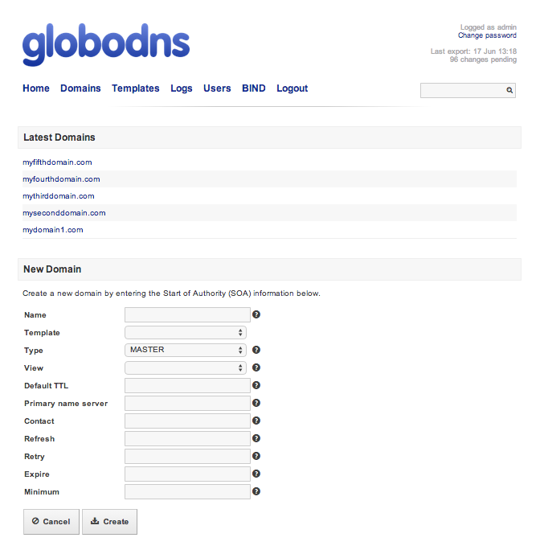

# Abstract

Once you've setup your environment, you can manage your domains/hosts entries from UI or API.

## Home

Logged as admin, in your home page, you can see the domain list (and reverse domains) or create a new domain.

*image1: Admin home page*

## Domains

## Templates

Dns-Api supports map zones templates, you can set some default values for TTL

* Default TTL
* Primary name server
* Contact
* Refresh
* Retry
* Expire
* Minimum
* Records

## Logs

Who, when and what a kind of changes have done on bind.

## Users

Add, change or delete user/roles/password. You have three user roles:

* **viewer**: read-only user. List domains and records.
* **operator**: viewer user roles + manage domains + manage records + manage templates + access to logs + export records.
* **admin**: operator user roles + manage users + export maps + reload bind.

## BIND

The named.conf file from master and slave DNS are shown here. Some actions over your bind can be done here:

1. Reload

   Send the HUP signal to the named process.

2. Export

    Export only the new records.

3. Export Now

    Export the new records and reload named process

4. Export All

    Export ALL files.